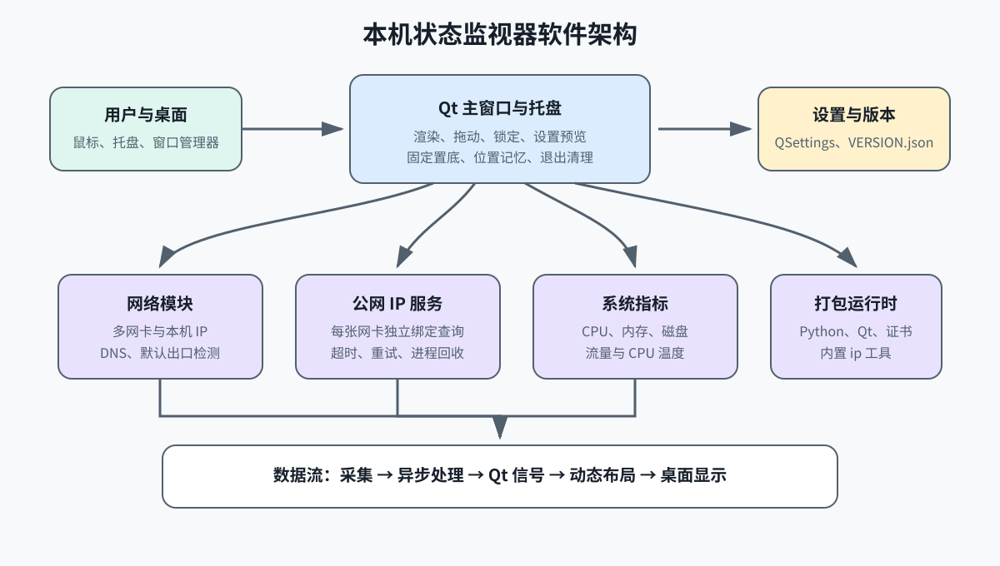
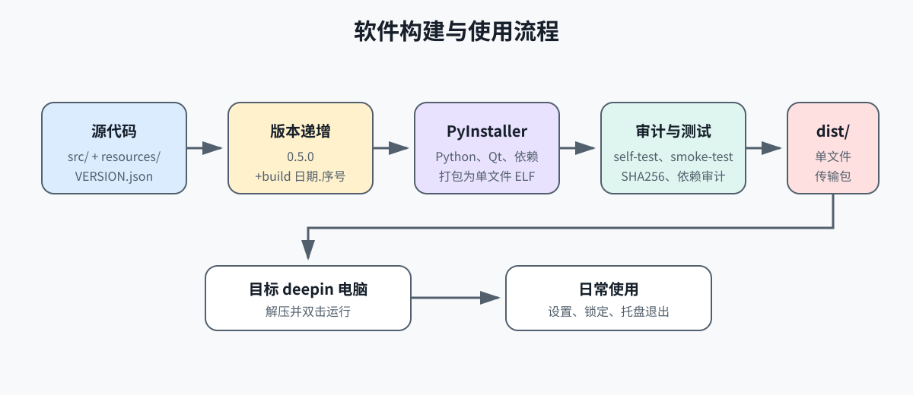
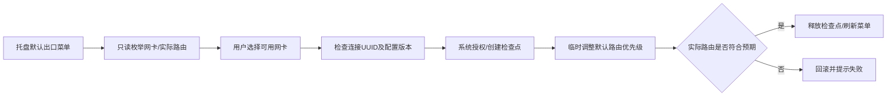

# 本机状态监视器

Linux/X11 下的 PyQt5 桌面小工具：默认出口网卡、多网卡本机/公网 IP、全局上传/下载速率、CPU/内存/根分区占用及 CPU 温度。

当前基础版本：`0.10.1`；每次执行构建脚本自动追加递增的 `+build.YYYYMMDD.N` 后缀。

## 运行

**单文件用户无需安装环境**：运行 `../dist/DesktopMonitor-deepin25-x86_64`，或将对应 `.tar.gz` 复制到另一台 deepin 25 x86_64 电脑后解压、双击运行。完整转移说明、平台范围及自检方式见 `PACKAGING.md`。程序固定置底，启动后请显示桌面查看。

项目已分类为 `src/`（代码与资源）、`docs/`（文档、图示和测试）、`dist/`（单文件与传输包）、`tables/`（完整文件清单）。以下步骤只适用于源码运行。

要求 Python 3.10+、支持托盘的桌面环境，以及提供 JSON 输出的 iproute2 `ip` 命令（用于只读检测默认路由）：

```bash
cd /home/biong/Documents/code/ip_monitor_widget/src
python3 -m pip install -r requirements.txt
./run.sh
```

窗口无边框、白色文字、默认 50% 背景 alpha，固定置于普通软件窗口下方，显示和托盘恢复时不抢占焦点。应用图标只显示在系统托盘，不创建任务栏入口。左键拖动；托盘“锁定”启用鼠标穿透。设置窗口支持字体/背景 alpha/刷新间隔的实时预览，保存生效，取消还原；修改字体时同步缩放窗体和留白，设置窗口自身样式不变，仍可正常获得焦点。两个窗口分别记忆位置，托盘可一键还原。

已移除“窗口置顶”设置，旧版保存的置顶配置自动忽略，并在下次保存时清理。切换锁定、修改设置、点击托盘都不会将监视器提升到普通窗口上方；设置界面以只读说明显示“始终置底”。

桌面窗口不再显示“本机状态监视器”标题，直接从默认出口信息开始。启动时保留记忆位置，并按当前内容收紧尺寸，避免旧标题留下空白；应用名称仅保留为系统窗口标识和托盘提示。

同一网卡的 IPv4/IPv6 和多个公网地址逐行显示；公网 IP 只显示通过本网卡查询的结果，查询未取得有效地址时显示“未连接公网”，不显示默认出口或其他网卡的地址。地址或指标变化后自动适配窗体大小，避免沿用旧窗口尺寸裁切文字。内容超过当前屏幕可用区域时提供滚动条，锁定状态下需先从托盘解锁再滚动查看。

**桌面嵌入已移除**。锁定只表示鼠标穿透，不承诺显示在桌面图标下方。

## 模块与文档

| 文件 | 功能 |
|---|---|
| `main.py` | 应用启动与事件循环 |
| `config.py` | 常量与默认设置 |
| `utils.py` | 速率格式化、稳定网络签名 |
| `network.py` | 在线网卡检测 |
| `default_route.py` | IPv4/IPv6 默认出口检测、异步命令及优先级选择 |
| `interface_dns.py` | 绑定设备的 DNS 查询，避免错误默认路由干扰 |
| `public_ip_lookup.py` | 公网 HTTP 查询子进程 |
| `public_ip_service.py` | 异步进程调度、超时、旧结果隔离 |
| `cpu_temperature.py` | CPU 温度识别 |
| `system_metrics.py` | 指标连续采样 |
| `settings_store.py` | 配置校验、QSettings 持久化 |
| `settings_dialog.py` | 独立设置界面 |
| `monitor_widget.py` | 监控显示与功能协调 |
| `tray_controller.py` | 托盘与退出清理 |
| `package_diagnostics.py` | 单文件依赖自检、无公网请求的 GUI/后台进程检查 |
| `about_dialog.py` | 关于页面，显示版本、开发者、Git 和编译信息 |
| `build_info.py` | 读取源码或单文件内置的 Git/编译信息 |
| `version.py`、`VERSION.json` | 运行时读取版本信息和构建后缀 |
| `packaging/` | 构建配置、锁定依赖、运行时环境隔离及原生依赖审计 |
| `SOFTWARE_INTERFACE.md` | 软件原理、架构/流程图、全部模块输入输出及通信协议 |
| `CODE_REVIEW.md` | 审查问题、优化措施、验证及限制 |
| `SOFTWARE_DEVELOPMENT_SPEC.md` | 软件开发目标、架构约束和质量门禁 |
| `AI_PROGRAMMING_STANDARD.md` | AI 辅助开发流程和编码约束 |
| `CHANGELOG.md` | 版本规则与变更履历 |
| `test_plan/`、`test_reports/` | 测试计划和独立测试报告 |
| `../tables/` | 项目所有文件夹和文件的表格清单 |
| `GIT_WORKFLOW.md` | 独立分支、提交与编译信息快照规则 |

## 行为说明

- 窗口顶部独立显示“默认出口 IPv4”和“默认出口 IPv6”，按设置的刷新间隔检测（默认每秒），即使本机 IP 未改变也会更新。相同优先级多路径逐行显示；无默认路由与检测失败分别提示。
- 默认出口取系统主路由表的有效默认路由，优先选择低 metric，IPv6 同 metric 再比较路由器偏好。不以公网查询成功与否猜测，因此无法联网的有线网卡也可能是默认出口；策略路由、VPN 和特定目的地址的实际出口可能不同，鼠标悬停可查看说明。
- 网卡在线指链路启用且存在有效 IP，不代表一定能访问互联网；离线网卡自动隐藏。
- Linux 公网查询同时绑定本地源地址和网卡设备，直连禁用环境代理；DNS 优先通过该设备查询；失败后在剩余预算内使用系统 DNS，以兼容 Tailscale 等代理。此回退仅用于域名解析，HTTPS 仍绑定原网卡，避免跨网卡借用公网地址。
- 每张网卡独立查询；失败即显示“未连接公网”，不等待或借用其他网卡的结果。窗口顶部的默认出口网卡检测仍保留，与公网 IP 状态互相独立。
- 公网查询最多 4 个并发子进程，每个已启动任务有 6 秒看门狗；DNS/HTTP 阻塞不会使界面永久“获取中”，网卡较多时需要排队。
- 查询失败后间隔 3 秒自动重试，最多额外 2 轮，并轮换首选服务；成功网卡不重复查询，恢复后显示本网卡地址。
- 指标默认每秒刷新，公网默认每 60 秒刷新，可在设置中独立调整为 10–3600 秒；网卡/IP 变化立即提交新查询。退出时终止查询子进程。
- 流量是所有网卡总量，硬盘使用率对应 `/`；CPU 传感器不可识别时显示“不可用”。
- 原 QSettings 命名空间和窗口几何键保持兼容。后台无外部控制端口；CPU/内存等指标不会上传到公网服务。

USB 网卡插入但尚未获得有效本机地址时会隐藏；取得地址后自动出现并查询。程序不会为无地址、无可用出口的网卡虚构公网 IP，常规监测不会修改 DHCP、路由或虚拟网络配置；只有明确点击新增的默认出口切换菜单，才会尝试临时修改路由优先级。

设备 DNS 模块依赖 `dnspython`，已列入 `requirements.txt`。设备绑定解析失败、仅有回环 DNS 或无同地址族 DNS 时，使用带 lifetime 限时的系统解析；兼容非回环 VPN DNS 代理，不再依赖无独立超时的 getaddrinfo。“未连接公网”依据本网卡公网 IP 查询结果显示；DNS、证书、权限或回显服务异常也可能导致该状态，不等同于完整的互联网连通性诊断。鼠标悬停公网 IP 可查看说明。

表中 Python 模块位于 `src/`，图标位于 `src/resources/`，文档位于 `docs/`。在 `src/` 下运行语法检查：`python3 -m py_compile *.py`。流程图使用 Mermaid 代码块，可在支持 Mermaid 的 Markdown 阅读器中渲染。

## 图形化说明

### 软件架构



软件按“界面层、采集层、异步服务层、打包运行时”分层。Qt 主线程只负责界面，网络公网查询和默认路由检测通过异步任务完成，查询结果经过校验后再更新窗口。

### 构建与使用流程



构建时先由版本管理器生成完整版本号，再由 PyInstaller 将 Python、Qt、证书、依赖库和 `ip` 工具打入单文件，随后执行原生依赖审计和自检。使用者只需将传输包复制到目标电脑、解压并双击运行。

## 软件构建指南

### 1. 构建环境

当前发布基线为 **deepin 25、x86_64、glibc 2.38+、X11 或可用 XWayland**。构建机需要 Python 3.12、pip、iproute2、binutils、dpkg 查询工具和可用的 Qt/X11 系统库。

构建脚本会把 Python 构建环境放在 `~/.cache/ip-monitor-widget/`，不会把虚拟环境、中间文件或日志写入项目目录，也不会修改系统 Python。

### 2. 源码运行

```bash
cd /home/biong/Documents/code/ip_monitor_widget/src
python3 -m pip install -r requirements.txt
./run.sh
```

源码运行适合调试和开发。首次运行会在用户 QSettings 中保存窗口位置、字体、透明度、刷新间隔和锁定状态。

### 3. 版本管理

查看当前版本：

```bash
cd /home/biong/Documents/code/ip_monitor_widget
python3 src/packaging/version_manager.py --show
python3 src/main.py --version
```

版本采用 SemVer：

| 变更类型 | 版本动作 | 示例 |
|---|---|---|
| 不兼容配置、接口或运行方式 | 递增 `MAJOR` | `1.0.0` → `2.0.0` |
| 向后兼容的新功能 | 递增 `MINOR` | `0.5.0` → `0.6.0` |
| BUG 修复、性能、文档、打包修复 | 递增 `PATCH` | `0.5.0` → `0.5.1` |
| 每次执行构建 | 自动递增 build 后缀 | `0.5.0+build.20260920.1` |

需要开始新的基础版本线时执行：

```bash
python3 src/packaging/version_manager.py --set-base-version 0.6.0
```

不要手工编辑 `build_suffix` 和 `build_number`；它们由版本管理器维护。

### 4. 构建单文件

在 deepin 25 x86_64 构建机执行：

```bash
cd /home/biong/Documents/code/ip_monitor_widget
./src/packaging/build.sh
```

如果构建依赖已经存在于缓存虚拟环境，可跳过依赖安装：

```bash
SKIP_INSTALL=1 ./src/packaging/build.sh
```

构建脚本依次执行：

1. 快照当前 Git 分支/提交/状态，再递增构建版本后缀。
2. 使用 PyInstaller 打包 Python、PyQt5、Qt 插件、证书、依赖库和 `ip` 工具。
3. 审计 ELF 动态库闭包和最低 GLIBC 版本。
4. 运行单文件 `--self-test`，结果写入 `docs/test_reports/PACKAGE_SELF_TEST.json`。
5. 生成单文件、传输压缩包、`BUILD_MANIFEST.json`、第三方许可归档和 `SHA256SUMS`。

### 5. 构建结果检查

```bash
./dist/DesktopMonitor-deepin25-x86_64 --version
./dist/DesktopMonitor-deepin25-x86_64 --self-test
./dist/DesktopMonitor-deepin25-x86_64 --smoke-test
(cd dist && sha256sum -c SHA256SUMS)
```

其中 `--smoke-test` 需要在可用的图形会话中运行，结果归档到 `docs/test_reports/PACKAGE_SMOKE_TEST.json`。完整验证范围见 `docs/test_reports/VALIDATION_REPORT.md`。

## 软件使用指南

### 1. 转移和启动

1. 推荐复制 `dist/DesktopMonitor-deepin25-x86_64.tar.gz` 到目标电脑。
2. 解压后双击 `DesktopMonitor-deepin25-x86_64`。
3. 如果文件管理器提示是否运行，选择运行；如果执行权限丢失，执行 `chmod +x DesktopMonitor-deepin25-x86_64`。
4. 程序启动后默认固定在普通窗口底部，请显示桌面查看；程序不显示标题栏，应用图标只显示在系统托盘。

单文件不需要目标电脑安装 Python、pip、PyQt5、requests、psutil 或 dnspython。目标电脑仍需提供兼容的 Linux glibc、图形会话、系统托盘和 X11/XWayland。

### 2. 主窗口操作

| 操作 | 结果 |
|---|---|
| 鼠标左键拖动 | 移动桌面监视器窗口 |
| 托盘右键“锁定” | 启用鼠标穿透，窗口不可被鼠标选中 |
| 托盘右键“解锁” | 恢复窗口交互和拖动 |
| 托盘右键“关于” | 打开版本、开发者、Git 和编译信息页面 |
| 托盘右键“设置” | 打开设置窗口 |
| 托盘右键“还原窗体位置” | 同时还原主窗口和设置窗口位置 |
| 托盘右键“退出” | 立即终止后台查询并退出程序 |

桌面嵌入功能已经移除；窗口会保持在普通软件窗口之下，但不承诺位于桌面图标层级之下。

### 3. 设置窗口

- **文字大小**：只改变桌面监视器窗口文字和窗口尺寸，设置窗口自身样式不变。
- **背景透明度**：只改变桌面监视器背景透明度，不改变设置窗口。
- **系统指标刷新间隔**：改变本机指标和网卡状态刷新频率，单位毫秒。
- **公网 IP 获取间隔**：独立设置 10–3600 秒，默认 60 秒；即使本机 IP 不变也会重新查询，保存后下次启动沿用。
- **实时预览**：拖动设置控件时立即更新主窗口。
- **取消**：恢复打开设置窗口前的所有状态。
- **还原默认设置**：一键恢复默认字号、透明度、刷新间隔和锁定状态。

### 4. 网络信息说明

- 只显示当前具有有效本机地址的网卡；断开或没有有效地址的网卡自动隐藏。
- 每张网卡独立查询公网 IP，不借用其他网卡或默认出口网卡的公网地址。
- 网卡无法访问公网、DNS 失败、TLS/防火墙阻断或回显服务不可用时显示“未连接公网”。
- 默认出口网卡检测独立于公网 IP 查询，无法联网的默认路由仍可能显示为默认出口。
- USB 网卡、`vmnet1`、`vmnet8` 等虚拟或新增网卡会随本机地址变化自动刷新。

## 常见问题

托盘右键选择“关于”，可查看完整版本、开发者显示名、Git 分支/提交、构建前工作树状态、
UTC 编译时间、目标平台、架构、Python 和打包器。字段可鼠标选中复制；页面使用独立字号和不透明背景。
单文件从内置快照读取信息，无需 Git 或源码目录；源码模式读取当前仓库。分支与提交流程见 `GIT_WORKFLOW.md`。

| 现象 | 处理方式 |
|---|---|
| 双击没有反应 | 确认文件有执行权限，并检查目标系统是否为 deepin 25 x86_64、glibc 2.38+ |
| 看不到窗口 | 先显示桌面；程序固定置底，不会覆盖其他软件 |
| 没有托盘图标 | 确认当前桌面会话支持系统托盘；可用 `--self-test` 检查依赖 |
| 公网 IP 显示“未连接公网” | 检查该网卡自身的 DNS、路由、防火墙和公网连通性，程序不会借用其他网卡结果 |
| `--smoke-test` 启动失败 | 在 X11 或可用 XWayland 图形会话中运行，不要在纯无头终端执行 |
| 目标电脑无法运行 | 该构建不保证 deepin 20/23、ARM64、LoongArch 或纯 Wayland 环境 |

## 默认出口切换（0.7.0）

1. 右键托盘图标，展开 **默认出口**。
2. 带勾项目是真实默认出口，`当前 IPV4` / `当前 IPV6` 标明地址族。点击其他可用网卡切换。
3. 系统如要求授权，请在桌面系统认证窗口完成；本软件不读取密码。切换过程中菜单禁止重复操作。
4. 成功后按实际路由更新勾选、桌面出口和公网查询。失败时提示原因并尝试恢复原配置。

无默认网关的 vmnet 网卡、未由 NetworkManager 管理的网卡仍会列出，但不能点击；无地址或断开的网卡隐藏。
目标仅有 IPv4 默认路由时只切换 IPv4，IPv6 保留原出口。普通 Tailscale 组网、DNS 和可判定的专用网段策略不再一律禁用菜单；软件只切换主路由表默认出口，保留专用策略。策略表包含默认路由、分拆全网路由或无法判定的规则时仍禁用；活动的 NetworkManager VPN 和不支持的默认多路径配置仍需系统网络设置处理。
切换可能中断现有连接，并不保证目标网卡能够访问公网。

本功能 **临时生效，网络重连或重启后恢复系统连接配置**，不持久改写 DHCP/静态连接档案。
需要目标系统运行 NetworkManager 1.42+、系统 D-Bus 和可用的 Polkit 授权服务；这些是主机服务，不能随单文件替代。
`dbus-next==0.2.3` 已内置单文件；源码运行需按 requirements.txt 安装。退出时不等待网络操作，未提交检查点最长 90 秒后由系统尝试回滚。



0.7.1 修复当前 Tailscale DNS 配置下无线网卡公网 IP 查询失败的问题；不需要关闭 Tailscale 或修改系统 DNS。实际查询仍受网络、服务可达性及证书影响，验证记录见 `test_reports/PUBLIC_IP_DNS_REPORT.md`。

0.7.2 修复“仅因存在策略路由就禁止切换”的误判：菜单现在检查主表之前的实际策略表，不删除 Tailscale 规则。
只有取得有效地址、受 NetworkManager 管理且已有默认网关/路由的网卡可以作为候选；当前出口可选中，但再次选择只是提示已是默认出口。
若当前只有无线满足条件，需先接通并配置有网关的另一张网卡，才能进行实际的不同出口切换。

## 公网 IP 定时刷新（0.8.0）

托盘右键 → **打开设置** → **公网 IP 获取间隔**，按秒输入需要的周期。
调整后立即按新周期重新计时，点击保存持久化；取消或关闭设置恢复打开前的间隔并重新计时；还原默认设置恢复 60 秒。
调整字号、透明度或系统指标刷新间隔不会重置公网倒计时。启动、网卡/IP 变化仍立即提交查询。
每次定时触发重新查询各网卡公网地址，成功后更新；查询或重试尚未完成时沿用现有防重入机制，跳过本次触发，避免大量并发和频繁中断查询。
因此所设间隔是查询触发周期，不保证公网服务在该时间内响应；刷新期间保留旧结果，失败按原规则显示“未连接公网”。

## 开机启动（0.9.0）

托盘右键 → **打开设置** → **开机启动 / 登录桌面后自动启动**。

- 默认关闭，不自动创建启动项；勾选后点击 **保存** 启用，取消勾选后保存关闭。
- 此功能在当前用户登录图形桌面时启动，不是在登录前运行系统服务；不需要管理员权限。
- 点击取消或关闭设置不改变自启动；还原默认设置将开关取消勾选，保存后才关闭已有启动项。
- 启动项为 `$XDG_CONFIG_HOME/autostart/org.biong.IPMonitorWidget.desktop`，未指定 XDG_CONFIG_HOME 时使用 `~/.config/autostart/`。
- 单文件启动项指向当前外部可执行文件，而非临时解包路径。请先把程序放在长期保存的位置；移动/重命名后，在新位置运行并重新启用、保存。
- 源码启动使用当前 Python 解释器和 main.py 绝对路径；需保留源码目录及 Python 环境。
- 设置页读取实际启动项状态，不依赖可能过期的单独布尔配置；写入失败会提示并保留设置窗口，不假装已保存。
- 关闭时写入本软件同名 Hidden 覆盖项，不删除或修改其他软件的启动项。

开关与系统字体/透明度预览不同：它只在保存时改动文件，避免预览或取消意外更改系统登录行为。

## 公网 IP 运营商（0.10.0）

每张在线网卡的公网 IP 下方新增独立的“运营商”行。例如：

```text
▸ 无线网卡
本机 IP       192.168.1.10
公网 IP       <该网卡实际公网 IP>
运营商        中国电信
```

- 确认公网 IP 后异步识别，无需额外配置。支持中国电信、中国联通、中国移动、中国教育网、中国科技网的常见登记名称。
- 双栈不同地址按 IPv4/IPv6 分行标注；鼠标悬停运营商可查看对应 IP、原始登记名称与 ASN（锁定时需先解锁）。
- 未取得公网 IP 时隐藏整行运营商（包括标题），不显示占位符；取得 IP 后归属查询期间显示“查询中…”；归属接口异常显示“暂未识别”，不会抹掉有效公网 IP。
- 未收录的机构显示“其他运营商”；多源 ASN 显示“多运营商（归属不唯一）”，不猜测。
- 公网 IP 按设置的周期重新检测；新地址立即查询归属。同一地址成功缓存 1 小时，失败缓存 60 秒，过期后随下一次公网结果刷新。
- 归属信息来自 RIPEstat：只提交已确认的公网地址及对应 ASN，不发送本机内网地址、网卡名称和配置。查询使用默认路由获取指定 IP 的归属信息，不改变原有网卡绑定的公网 IP 检测。
- 名称表示公网出口自治系统，VPN、代理、云服务出口不一定等于本地宽带签约运营商。外部服务故障或登记信息变化可能导致暂未识别或缓存延迟。

## 自启动与开始屏幕隔离（0.10.1）

启用“开机启动”只登记当前用户的登录启动项，不在开始屏幕添加图标，也不安装应用菜单快捷方式。程序运行时仍使用系统托盘入口。

启动项启用时使用 `NoDisplay=true`、`Hidden=false`；关闭时保留 `NoDisplay=true`、`Hidden=true` 的禁用覆盖项。两个字段分别控制菜单显示和自动启动，不能混用。

保存后通过 Qt D-Bus 异步通知 deepin 应用管理器重读缓存；新版启动时自动修补旧启动项的隐藏标记，保留原命令和启停状态。首次运行不存在启动项时不创建任何文件。修补失败会在标准错误输出警告，不阻止监视器运行。

本轮已备份并清除当前电脑的旧缓存图标，保持原有自启动关闭状态。请退出旧版实例再运行新版，避免旧版设置窗口重新写入旧格式。其他桌面没有 deepin 应用管理器时跳过异步通知，由桌面自身按 XDG 规则刷新。
