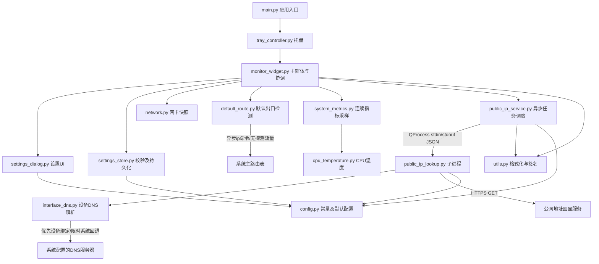
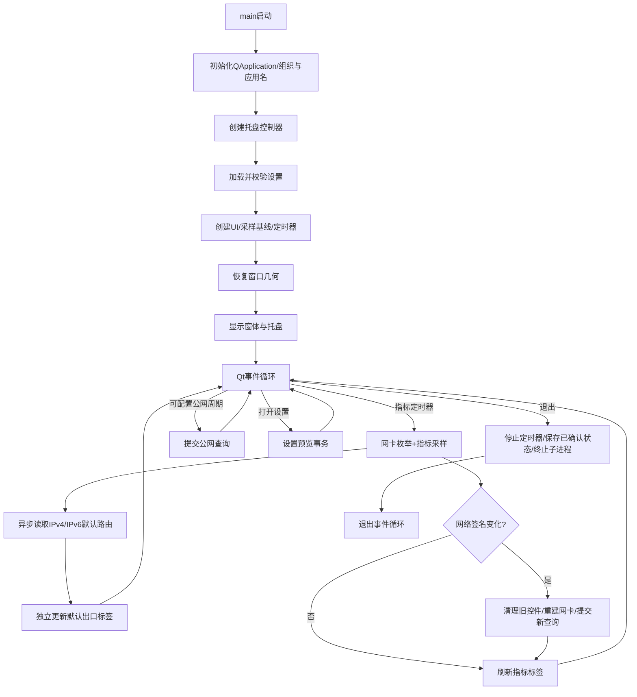
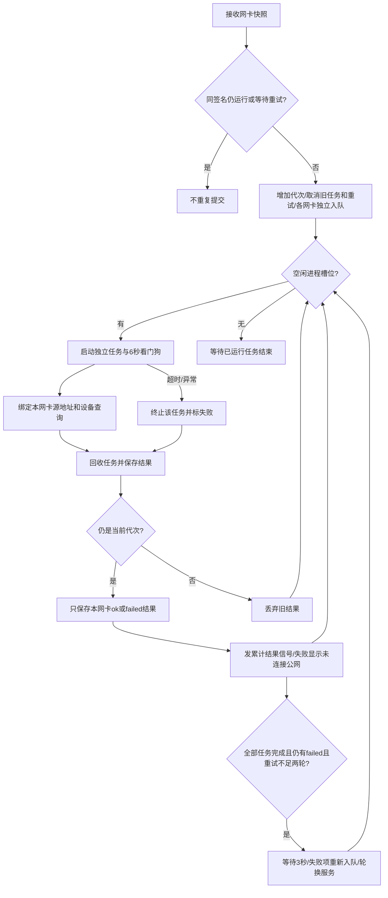
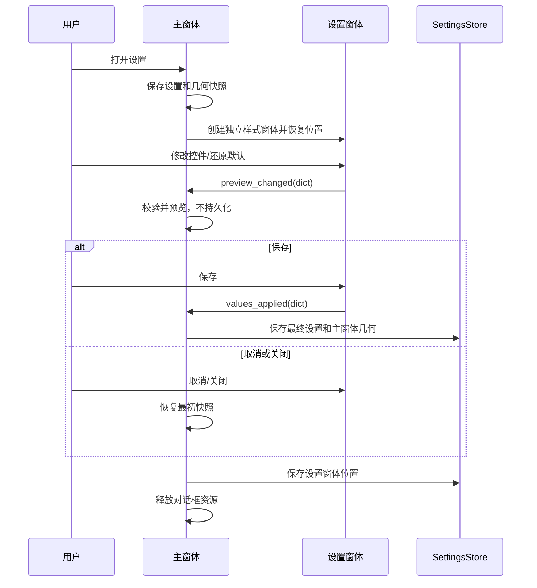
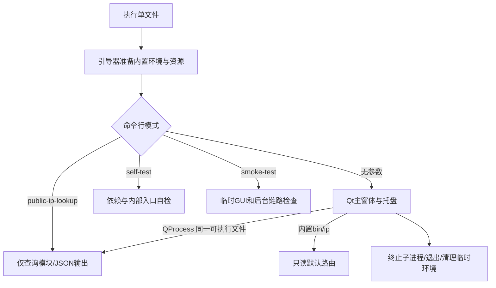
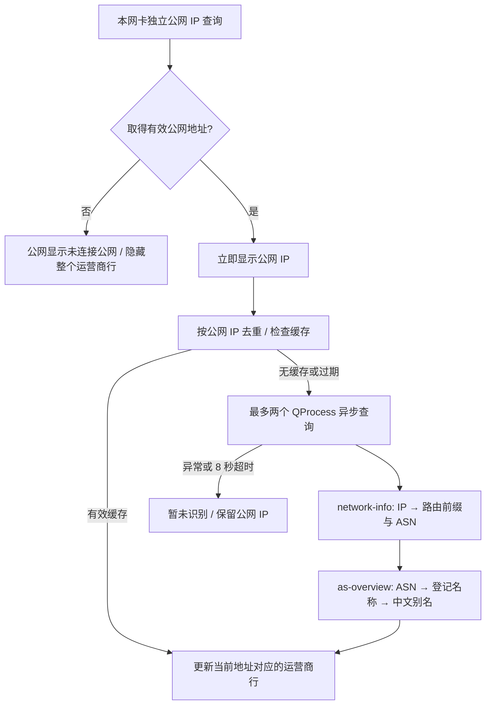
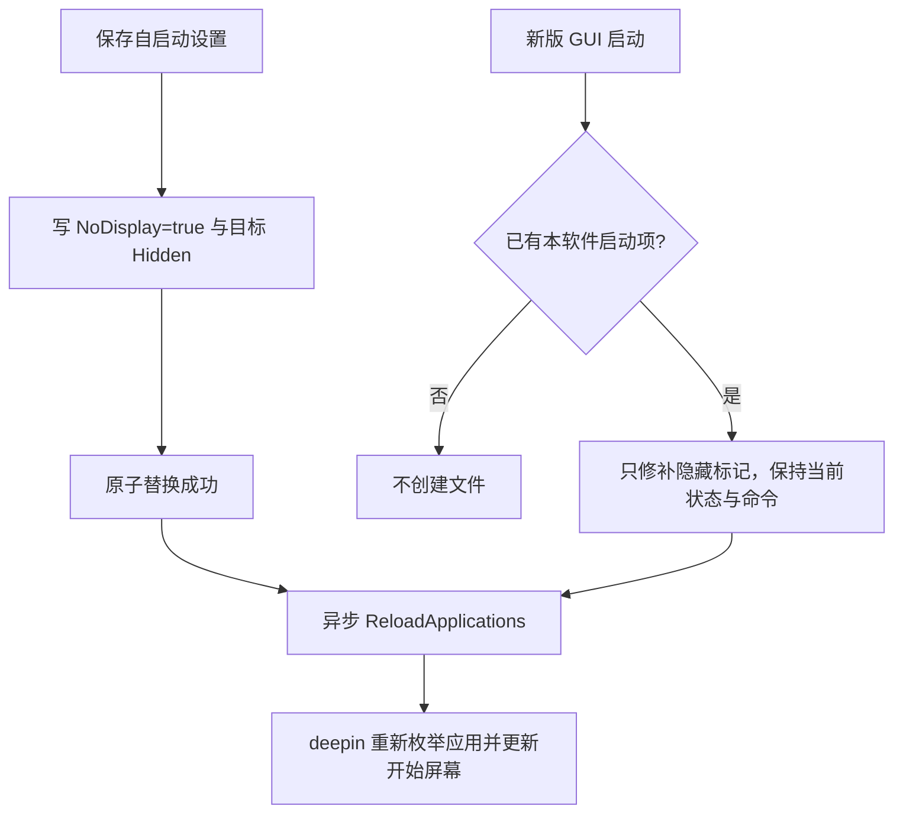

# 本机状态监视器：软件原理与接口说明

文档版本：4.0（目录、测试与版本管理）　更新日期：2026-09-21　编码：UTF-8

本文描述**当前源代码**，不是尚未实现的设计。接口包含 Python 调用、Qt 信号、子进程 JSON、HTTP 客户端与本地配置；本软件不提供 HTTP 服务器、开放端口或远程控制接口。

## 1. 运行条件与功能边界

- 源码运行使用 Python 3.10+；依赖见 `src/requirements.txt`：PyQt5、psutil、requests、dnspython。单文件发布已内置 Python 3.12 与这些依赖，无需目标机器安装 Python。
- 目标环境：Linux/X11，且桌面环境应提供系统托盘。Wayland 下置底、锁定、坐标定位不作兼容性保证。
- 默认出口检测使用 iproute2 的 `ip -j` JSON 输出，只读取主路由表；不需要 root，不修改网络配置或发送探测包。源码使用系统 ip，冻结包使用内置 bin/ip 及其共享库。
- 使用普通用户权限运行，无须 root。外网查询需要 DNS、TLS 与 HTTPS 出口；禁止 TLS 证书校验的绕过行为。
- 项目根目录按 `src/`、`docs/`、`dist/` 分类；测试计划独立放在 `docs/test_plan/`，测试结果独立放在 `docs/test_reports/`。源码通过 `src/run.sh` 启动；单文件通过 `dist/DesktopMonitor-deepin25-x86_64` 启动，图标从模块目录下的 resources/icon.svg 解析，冻结时对应内置资源目录。
- 单文件适用于 deepin 25 x86_64（glibc 2.38+），不保证旧版 deepin、其他架构或没有 X11/XWayland 的环境；详细交付范围见 `PACKAGING.md`。
- 保留：IPv4/IPv6 默认出口网卡、多网卡、本机/公网 IP、上下行总速率、CPU/内存/根分区占用、CPU 温度、透明背景、拖动/锁定、固定置底、设置预览/取消/默认、双窗口位置记忆和还原。
- **不含桌面嵌入**，不调用 X11 重父化或调整桌面图标层级。锁定仅代表鼠标穿透，不代表进入桌面背景层。

## 2. 软件原理

### 2.1 主事件循环

`QApplication` 在主线程运行 Qt 事件循环。指标定时器按配置的 `interval` 读取本地信息，公网刷新定时器按 `public_ip_interval` 秒提交快照（默认 60 秒，范围 10–3600）。网卡名称/IP 变化不等待该周期，会立即触发新查询。Qt 控件只在主线程操作。

默认出口在每次指标刷新时独立启动异步查询，不以网卡/IP 签名变化为前提。IPv4、IPv6 各最多一个 `ip` 子进程；尚有任务时不重复启动，每个命令有 1500 ms 看门狗。查询完成后分别更新窗口顶部两行，不改变各网卡公网 IP 查询结果。判断范围为 main 表通用默认路由：过滤失效/拒绝/来源受限路由，优先最低 metric，IPv6 同 metric 比较 pref；相同优先级的设备去重后逐行显示。它反映默认路由配置，不表示公网可用，也不覆盖策略路由、VPN、特定目的地址路由的全部选路行为。

### 2.2 本地采集与计算

`psutil.net_if_stats()` 判断网卡链路是否启用；`net_if_addrs()` 提供地址。只保留 IPv4/IPv6，过滤回环、链路本地、组播和未指定地址。地址去重、排序后形成稳定签名。

网络速率计算：

```text
elapsed = max(0.001, monotonic_now - monotonic_previous)
upload_bps = max(0, bytes_sent_now - bytes_sent_previous) / elapsed
download_bps = max(0, bytes_recv_now - bytes_recv_previous) / elapsed
```

使用单调时钟，避免系统校时影响计算。无可用计数时速率显示 0；计数回退被钳制为零。上传/下载是 `net_io_counters()` 全局总量，**不是每张网卡的独立速率**，可能包含回环和虚拟网卡流量。

CPU 为 `cpu_percent(interval=None)` 的连续采样值；首次初始化建立基线，首次显示可能为 0。内存来自 `virtual_memory().percent`；磁盘为 `/` 所在文件系统的使用率，并非所有物理硬盘平均值。CPU 温度只选择明确的 CPU 驱动/thermal zone，不再将显卡、硬盘或未知 ACPI 温度冒充 CPU 温度。

### 2.3 公网查询与退出

每张网卡的绑定查询使用一个短生命周期 Python 子进程，父进程通过 `QProcess` 异步收发 JSON。最多同时运行 4 个，其余排队。子进程使用 requests 逐个访问服务；不创建默认出口公网查询任务，不复用其他网卡的地址。

- 直连阶段总协作预算 2.5 秒；每个地址族最多选择一个源地址，优先 IPv4，然后 IPv6。
- 通过 urllib3 连接池 `source_address=(local_ip, 0)` 绑定本地源地址，Linux 还设置 `SO_BINDTODEVICE` 绑定网卡设备，直连时禁用环境代理。设备绑定失败不会静默降级为未绑定连接。
- `interface_dns.py` 使用系统配置的非回环、同地址族 DNS 服务器，通过绑定相同设备及源地址的 UDP 套接字解析 A/AAAA；各服务器分摊最多一半解析预算，另一半预留给系统 DNS 回退。TCP 建连时使用解析出的地址，随后恢复原域名用于 TLS 证书校验、SNI 和 HTTP Host，不禁用证书验证。
- 设备绑定解析失败、仅有回环 DNS 代理或没有同地址族外部 DNS 时，在剩余总预算内调用系统配置的 dnspython Resolver.resolve，指定 lifetime 和 search=False；不调用无独立超时的 getaddrinfo。此路径兼容 Tailscale 等非回环 DNS 代理，仍受进程看门狗约束。程序不更改系统 DNS，也不添加额外公共 DNS 服务器。
- 连接超时上限 0.6 秒、读超时上限 1 秒，并按剩余预算缩短。
- requests 的读/连接超时并不保证 DNS 或整次请求准时结束。因此父进程从任务启动起另设 **6000 ms 看门狗**，超时杀掉该子进程。本网卡任务失败即提交 failed，不等待其他网卡是否成功。
- 6 秒针对**每个已启动任务**，不含排队；N 张网卡首轮最坏需约 `ceil(N/4) × 6 秒` 加进程和事件调度开销，不作实时系统级时限保证。
- 一轮全部完成后仍有 failed 网卡，则间隔 3 秒自动重试这些网卡；最多额外 2 轮，成功的 ok 项不重新查询。重试通过 `attempt` 轮换首选服务，避免一直卡在同一个服务；全部轮次结束后仍保留按配置周期刷新（默认 60 秒）。
- 查询服务维护递增代次。网卡变化时取消旧任务及待执行重试，旧代次即使延迟结束也不能提交结果。无可用本机地址的 USB 网卡不会进入查询队列，取得地址后由快照变化触发查询。
- 退出时先禁止新任务、停止重试定时器、清空队列、终止全部子进程，再逐个最多等待 500 ms 回收。没有 `QThread`/线程池退出等待，也没有无法取消的 Python DNS 线程留在主进程。

仅绑定源地址不能保证所用设备，因此当前 Linux 查询同时绑定源地址和设备；实际公网地址仍可能经过 VPN/NAT。查询未取得有效公网地址时显示“未连接公网”，不会显示默认出口或其他网卡的 IP。此文本是查询结果映射，并非完整连通性诊断：DNS、证书、权限或服务故障也可能导致 failed。失败后清除本网卡旧公网 IP，恢复后更新为新的有效地址。

## 3. 模块架构与依赖



| 文件 | 职责 | 输入 | 输出/副作用 |
|---|---|---|---|
| `main.py` | 初始化 Qt、进入事件循环 | `sys.argv` | 进程退出码 |
| `config.py` | 集中定义常量、默认值 | 无 | 配置常量，无 I/O |
| `utils.py` | 数据格式化与稳定签名 | 速率、网卡列表 | 文本、元组，无 I/O |
| `network.py` | 枚举在线网卡 | OS 网络状态 | 网卡快照，无外网访问 |
| `default_route.py` | 默认出口选择、命令超时及回收 | ip 命令 JSON 路由列表 | IPv4/IPv6 设备名快照，无外网请求 |
| `interface_dns.py` | 设备绑定解析及限时系统 DNS 回退 | 域名、源地址、设备、超时 | 目标地址列表，DNS I/O |
| `public_ip_lookup.py` | 单网卡公网 HTTP 查询 | JSON 网卡对象 | JSON 查询结果，HTTPS I/O |
| `public_ip_service.py` | 限流、排队、超时、代次隔离 | 网卡快照 | Qt 结果信号，管理子进程 |
| `cpu_temperature.py` | 识别 CPU 温度 | psutil、thermal 文件 | 温度文本或“不可用” |
| `system_metrics.py` | 系统指标连续采样 | OS 指标、上次计数/时刻 | 指标快照 |
| `settings_store.py` | 校验设置、持久化几何 | 设置字典、QByteArray | QSettings 本地文件 |
| `settings_dialog.py` | 独立样式的设置窗口 | 当前值、默认值 | 预览/保存信号、对话框返回值 |
| `monitor_widget.py` | 渲染、拖动、设置事务和协调 | 所有业务数据、交互事件 | 主窗体、服务调用 |
| `tray_controller.py` | 菜单与应用清理接线 | QApplication、可选注入依赖 | 托盘图标、主窗体 |
| `package_diagnostics.py` | 单文件运行诊断 | 自检/GUI 测试入口 | JSON 检查结果、退出码；GUI 测试使用临时配置 |
| `about_dialog.py` | 关于页面 | 托盘“关于”动作 | 版本、开发者、Git 和编译信息 |
| `build_info.py` | 读取构建元数据 | 源码 Git 或冻结包 BUILD_INFO.json | Git/编译信息字典 |
| `version.py`、`VERSION.json` | 运行时版本读取 | 启动参数/版本文件 | 当前应用版本字符串 |
| `packaging/version_manager.py` | 基础版本和编译后缀管理 | `--set-base-version`、`--bump-build` | 更新后的版本 JSON |

上述模块均位于 src/；src/packaging/ 是构建工具，不参与普通运行。应用资源位于 src/resources/，构建配置将资源映射到冻结运行目录中的相同相对位置。

`public_ip_service.py` 复用 `public_ip_lookup.parse_public_ip` 校验子进程结果，但 HTTP 函数只在子进程调用。没有循环模块依赖。

## 4. 主流程框图



## 5. 数据对象协议

### 5.1 网卡快照 `InterfaceSnapshot`

```json
[
  {"name": "eth0", "ips": ["192.168.1.20", "2001:db8::20"]},
  {"name": "wlan0", "ips": ["192.168.2.30"]}
]
```

- Python 类型：`list[dict]`；每个对象必须有 `name: str` 和非空 `ips: list[str]`。
- `name` 在快照中唯一，地址是去掉 IPv6 zone 后的规范字符串。示例中的文档保留地址仅用于说明结构。
- `get_network_interfaces()` 已排序、去重；失败或无在线网卡返回 `[]`。
- 在线定义为 `isup=True` 且有可用地址。虚拟网卡也可能满足；不检测物理线缆质量、Wi-Fi 门户或实际互联网可达性。

### 5.2 网络签名 `NetworkSignature`

```python
(("eth0", ("192.168.1.20", "2001:db8::20")),)
```

类型：`tuple[tuple[str, tuple[str, ...]], ...]`。`network_signature()` 对网卡和地址排序、地址去重，因此枚举顺序变化不引发重复查询。签名在 Qt 进程内部传递，不发送给公网服务。

### 5.3 查询结果 `LookupResult`

```json
{"status": "ok", "addresses": ["8.8.8.8"]}
```

| 字段 | 类型/取值 | 约束 |
|---|---|---|
| `status` | `ok` / `failed` | `ok`=本网卡绑定查询得到回显；`failed`=本次未得到有效公网地址 |
| `addresses` | `list[str]` | 成功时非空、去重、全局单播 IPv4/IPv6；失败时 `[]` |

上述公网地址仅是格式示例，不代表本机真实查询结果。子进程仅返回 ok/failed；父进程再次校验 JSON 和 IP，异常退出、启动失败、超时、非法/过长输出均视为该网卡 failed。结果独立保存到相应网卡，不合并其他出口。旧 fallback 结果视为无效，不再提供 source_interface 字段。

界面映射：尚未完成=`获取中…`；成功=本网卡地址列表；失败=`未连接公网`。同一网卡的本机/公网地址每个地址单独一行；已移除默认出口/其他网卡来源标签。每个网卡完成后立即更新，其余继续查询。定期刷新保留已有显示直到该网卡新结果返回，不每分钟闪回“获取中”；失败结果到达即清除旧地址。Qt 信号参数保持不变，结果只保留 status/addresses；旧 fallback 即使携带地址也不会显示。

### 5.4 指标快照 `MetricsSnapshot`

| 字段 | Python 类型 | 单位/缺失值 | 含义 |
|---|---|---|---|
| `upload_bps` | `float` | Byte/s，缺计数为 0 | 全局总上传速率 |
| `download_bps` | `float` | Byte/s，缺计数为 0 | 全局总下载速率 |
| `cpu_percent` | `float \| None` | %；None 显示不可用 | 系统 CPU 使用率 |
| `memory_percent` | `float \| None` | %；None 显示不可用 | 系统内存使用率 |
| `disk_percent` | `float \| None` | %；None 显示不可用 | 根文件系统使用率 |
| `temperature` | `str` | 如 `65 °C` 或 `不可用` | CPU 温度 |

`format_rate()` 按 1024 换算，沿用界面 B/s、KB/s、MB/s、GB/s 标签；0 级显示整数，其他级显示一位小数。

### 5.5 设置对象 `SettingsValues`

| 字段 | 类型 | 默认 | 有效范围/用途 |
|---|---|---|---|
| `font_size` | int | 16 | 8–48，像素，不是 Qt 点值 |
| `opacity` | float | 0.50 | 0.10–0.95，背景 alpha；数值越大越不透明，文字保持白色不透明 |
| `interval` | int | 1000 | 500–10000 ms；UI 步进 500，不限制文件只能取整步长 |
| `public_ip_interval` | int | 60 | 10–3600 秒；旧配置缺省默认值，保存至相同 QSettings 命名空间 |
| `locked` | bool | false | Qt 鼠标穿透标志，仅托盘控制 |

`normalize_settings()` 忽略未知键；非法数字、NaN/Infinity 回退默认；有限越界值钳制到范围；布尔兼容 true/false、1/0、yes/no，非法布尔回退默认。返回完整新字典，不修改输入。

设置对话框发出的字典只含 font_size、opacity、interval 三项。默认按钮也只恢复这三项，不改变锁定状态、窗口位置；位置通过独立菜单还原。监视器固定置底，不提供层级开关；旧 always_on_top 键在加载/预览时忽略，在 SettingsStore.save 时单独删除，不清空其他设置。

## 6. Python 模块输入/输出接口

下表列出跨模块公共接口；下划线开头方法和 Qt 事件重载属于内部实现，不应由外部插件直接调用。

### 6.1 应用、常量、工具

| 接口 | 输入 | 返回/副作用 |
|---|---|---|
| `main.main()` | 无显式参数，读取 `sys.argv` | int Qt 退出码；创建应用并阻塞到退出 |
| `config.APP_NAME/ORG_NAME/APP_ID/ICON_PATH` | 无 | 显示名、持久化命名空间、图标绝对路径 |
| `config.DEFAULT_SETTINGS` | 无 | 默认设置；调用方复制使用，不应修改原字典 |
| `utils.format_rate(bytes_per_second)` | 有限 float，Byte/s | str；负值按 0 |
| `utils.network_signature(interfaces)` | 网卡快照 | 稳定元组 |

公网常量：`PUBLIC_IP_LOOKUP_SECONDS=2.5`、`PUBLIC_IP_CONNECT_SECONDS=0.6`、`PUBLIC_IP_READ_SECONDS=1.0`、`PUBLIC_IP_PROCESS_TIMEOUT_MS=6000`、`PUBLIC_IP_INTERVAL_LIMITS=(10,3600)`（秒，默认值见 DEFAULT_SETTINGS）、`PUBLIC_IP_MAX_PROCESSES=4`、`PUBLIC_IP_RETRY_MS=3000`、`PUBLIC_IP_MAX_RETRIES=2`；`PUBLIC_IP_ENDPOINTS` 是按顺序尝试的 HTTPS URL 元组，重试轮换起点，不承诺服务持续可用。

### 6.2 网卡与公网 HTTP

| 接口 | 输入 | 返回/失败 |
|---|---|---|
| `network.get_network_interfaces()` | 无 | 网卡快照；本地读取异常返回 [] |
| `public_ip_lookup.parse_public_ip(body)` | str 纯文本 | 规范 IP 或 None；拒绝私网、组播、混合内容 |
| `SourceAddressAdapter(source_address, interface_name=None)` | 合法 IP str，可选网卡名 | requests HTTPAdapter，注入源地址；Linux 指定网卡时使用设备绑定和独立 DNS 连接池，不修改 urllib3 全局池类型 |
| `interface_dns.resolve_interface_host(host, local_ip, interface_name, timeout)` | 域名、本机 IP、设备名、解析总预算秒 | 同地址族目标 IP 字符串列表；解析失败抛异常；UDP DNS I/O，仅在子进程调用 |
| `query_endpoints(local_ip, deadline, attempt=0, interface_name=None)` | 本机 IP；单调时钟绝对截止秒；重试轮次；必填网卡名 | IP 或 None；缺少 IP/网卡时抛 ValueError，不执行默认出口查询；有 DNS/HTTP I/O，**只在子进程调用** |
| `lookup_interface(interface)` | 单个网卡对象，可含 attempt | 仅绑定查询的 LookupResult（ok/failed），不自行兜底 |
| `public_ip_lookup.main()` | stdin UTF-8 JSON | stdout 一行 JSON，int 退出码 |

### 6.3 查询调度服务

| 接口 | 输入 | 返回/副作用 |
|---|---|---|
| `PublicIPService(parent=None)` | 可选 QObject 父对象 | 服务实例，无任务时不创建进程 |
| `request(interfaces)` | 完整网卡快照 | None；替换旧批次，异步派发；同快照已有任务时去重 |
| `result(signature, results)` | Qt 信号 | `object, object`；前者 NetworkSignature，后者 `dict[name, LookupResult]` |
| `shutdown()` | 无 | None；停止新任务、杀进程并有限等待，调用后不可重启 |

结果信号是本批次已完成网卡的**累计快照**，不含未完成网卡；每张网卡完成后立即提交自己的成功或失败结果，不等待其他出口。空网卡立即发出 `{}`。自动重试保留上次结果直至新结果返回；同快照在查询或等待重试时不重复提交。各次发信号均复制结果字典，接收方不得修改其中嵌套对象。调用和槽函数均在 Qt 主线程执行。代次是内部整数，不暴露给 UI。

### 6.4 系统指标与温度

| 接口 | 输入 | 返回/副作用 |
|---|---|---|
| `SystemMetricsSampler()` | 无 | 建立网络/CPU 基线；应在同一线程创建与调用 |
| `sample()` | 无 | MetricsSnapshot；更新内部计数基线 |
| `cpu_temperature.get_cpu_temperature()` | 无 | str 温度或不可用 |

单项系统读取异常返回 None，不使整个采样失败。温度依次选择 coretemp、k10temp、cpu_thermal、zenpower，优先 Package/Tdie/Tctl，否则最高核心值；再读取类型含 cpu 或等于 x86_pkg_temp 的 thermal zone。只接受 -20～150°C 之间有限值，不进行硬件校准。

### 6.5 配置存储

| 接口 | 输入 | 返回/副作用 |
|---|---|---|
| `SettingsStore(settings=None)` | 可选 QSettings | 默认使用 Biong/IPMonitorWidget；可注入临时 INI 做验证 |
| `load()` | 无 | 完整、校验后的 SettingsValues |
| `save(values, geometry)` | 设置字典、QByteArray | 清理废弃 always_on_top 键，持久化已知配置和主窗体几何、sync |
| `load_geometry(key)` | geometry / settings_geometry | QByteArray；缺失或类型错误为空 |
| `save_geometry(key, geometry)` | 键、QByteArray | 保存窗口几何、sync |
| `reset_settings_position()` | 无 | 删除 settings_geometry、sync |
| `normalize_settings(values)` | 部分或完整 dict | 完整合法新设置字典 |

写入失败通过 logging 警告，内存状态仍可用。配置不是密码存储，不包含用户凭据。

### 6.6 设置对话框与主窗体

主窗体内容从默认出口信息开始，不创建应用名称标题标签及标题专用样式。窗口管理器所用的 windowTitle 和托盘提示仍保留应用名称，原生窗口继续无边框。启动恢复几何后按当前内容重新计算尺寸，保留原有位置并受屏幕边界约束，不保留旧标题占用的空白；数据与设置接口不变。

| 接口 | 输入 | 输出/行为 |
|---|---|---|
| `SettingsDialog(values, defaults, parent=None)` | 已校验设置、默认值 | 独立字体/不透明窗口；主窗体传 parent=None 避免样式继承 |
| `current_values()` | 无 | 三个可编辑字段组成的新 dict，不包含窗口层级 |
| `preview_changed(dict)` | Qt 信号 | 用户改变控件/还原默认时同步发出 |
| `values_applied(dict)` | Qt 信号 | accept 时发出，然后结束对话框 |
| `restore_defaults()` | 无 | 批量屏蔽中间信号，恢复后发一次预览 |
| `MonitorWidget(tray, network_provider=None, settings_store=None)` | QSystemTrayIcon；可注入采集函数/存储 | 主窗体实例，正常由托盘控制器显示 |
| `update_metrics()` | 无 | 检测网卡、刷新全部指标标签 |
| `refresh_network_interfaces()` | 无 | 签名变化才重建网卡 UI、提交新查询 |
| `fetch_public_ip()` | 无 | 向服务提交当前快照 |
| `set_public_ips(signature, public_ips)` | 签名、累计结果字典 | 仅接受当前签名，并映射状态文本 |
| `toggle_lock(checked=None)` | bool 或 None | 明确设置/反转穿透标志，保存配置 |
| `open_settings()` | 无 | 模态设置事务；重复调用只激活已有窗口 |
| `preview_settings(updated)` | 可编辑字段 dict | 校验并预览，不落盘 |
| `restore_settings_preview(original_values, original_geometry)` | 设置快照、QByteArray | 恢复值、刷新间隔、标志和窗体尺寸/位置 |
| `apply_settings(updated)` | dict | 提交预览并保存 |
| `reset_window_positions()` | 无 | 主窗体移至 (36,120)，设置位置清除/居中 |
| `shutdown()` | 无 | 幂等清理、停止定时器、保存已确认设置、终止查询 |

字体变化同步缩放像素字体、留白、间距、最小宽度、圆角以及前次窗口宽高；仅调整背景 alpha 不触发字体/窗口缩放。内容最小尺寸、整数像素取整或网卡内容变化可能限制精确比例，优先避免裁剪文本。

监控内容放在透明 QScrollArea 中，标签按完整文本的最小尺寸布局。异步结果/指标变化通过单次定时器合并布局请求，按内容扩展窗体；普通数据更新不反复缩小窗口，避免抖动。启动恢复旧几何、取消预览后也校验内容尺寸。窗体大小和位置受当前屏幕可用区域约束；放不下时出现垂直或水平滚动条，所有内容可滚动查看，不缩小字体或省略地址。鼠标穿透锁定时不能操作滚动条，需要先解锁。

主窗体使用 `Qt.Window | Qt.FramelessWindowHint | Qt.WindowStaysOnBottomHint | Qt.WindowDoesNotAcceptFocus`，锁定时额外添加 `WindowTransparentForInput`；使用独立普通窗口而非 Tool，避免工具窗口跟随所属窗口组提升层级。`WA_ShowWithoutActivating` 避免显示时抢占焦点；showEvent 和鼠标按下时 lower。原生窗口因锁定切换而重新映射后，通过单次定时器向 QWindow 重新提交置底标志，修复目标 X11 窗口管理器丢失 BELOW 状态的情况；退出时停止该定时器。设置窗口保持 parent=None，不继承置底及拒绝焦点标志，可正常操作。此实现不设置 Desktop 窗口类型、不重父化、不承诺处于桌面图标下方。

### 6.7 托盘接口

`TrayController(app, network_provider=None, settings_store=None)` 持有托盘、菜单和主窗体，并自动连接 `app.aboutToQuit → widget.shutdown`。依赖注入仅用于离线验证，不改变正常默认行为。

| 菜单动作 | 行为 |
|---|---|
| 锁定（鼠标穿透，不可选中） | 切换 locked；打开菜单时同步勾选状态 |
| 打开设置 | `widget.open_settings()` |
| 还原桌面和设置窗体位置 | `widget.reset_window_positions()` |
| 退出 | `app.quit()`，进而统一清理 |

托盘单击调用主窗体 showNormal/lower，仅恢复显示并保持置底，不 raise 或激活主窗体，不新增桌面嵌入操作。设置窗口仍按普通对话框方式显示、激活。

### 6.8 默认出口接口

| 接口 | 输入 | 返回/副作用 |
|---|---|---|
| `default_route.parse_default_interfaces(routes)` | `list[dict]`，ip JSON 路由列表 | `list[str]`，选中的设备名，去重排序；非法数据抛异常；无有效默认路由为 [] |
| `DefaultRouteService(parent=None, command=None)` | 可选 QObject 父对象、命令路径（测试可注入） | 未指定时源码使用系统 ip，冻结运行使用内置 bin/ip；创建时不执行命令 |
| `refresh()` | 无 | 异步读取两种地址族；任务运行中或已退出时不重复启动 |
| `result(routes)` | Qt object 信号 | `{"ipv4": list[str] 或 None, "ipv6": list[str] 或 None}`，两种地址族都完成后发出 |
| `shutdown()` | 无 | 停止接单/看门狗，终止子进程并逐个最多等待 500 ms 回收 |
| `MonitorWidget.set_default_routes(routes)` | 上述结果字典 | 更新 `labels["default_ipv4"]`、`labels["default_ipv6"]`，触发内容尺寸适配 |

结果示例：`{"ipv4":["wlp0s20f3"],"ipv6":[]}`。空列表显示“无默认路由”，None 显示“检测失败”，初始显示“检测中…”，多个设备用换行显示。结果不持久化；每次启动重新检测。检测失败不沿用旧出口。默认出口网卡显示与各网卡公网 IP 查询独立，互不覆盖。

命令通过 QProcess 直接执行，无 shell：`ip -j -4 route show table main default`、`ip -j -6 route show table main default`。stdout JSON 最多接受 65536 字节，stderr 及时排空；非零退出、启动失败、非法 JSON、超量输出、超时均令该地址族返回 None。ECMP 的 nexthops 中保留有效设备；只有 nhid 而未展开设备的下一跳对象目前报告检测失败，不误报为无默认路由。

## 7. 子进程与外部服务协议

### 7.1 父子进程通信

```text
源码命令：当前 sys.executable + public_ip_lookup.py 的绝对路径
冻结命令：当前可执行文件 + --public-ip-lookup
stdin：单个查询任务 JSON 对象的 UTF-8 字节；发送完成后关闭写通道
stdout：单个 LookupResult JSON 对象（仅 ok/failed），以换行结尾
stderr：故障诊断，不属于结果协议；父进程及时读取避免管道堵塞
```

- 网卡任务：`{"name":"eth0","ips":["192.168.1.20"],"attempt":0}`；name 必须为非空网卡名，ips 为本网卡地址。缺少 name 的旧默认出口任务会失败，不发起查询。
- attempt 为非负重试轮次，首次 0；按 `attempt % 服务数量` 轮换服务顺序。仅支持指定网卡查询，不提供默认出口任务。
- 不使用 shell 拼接命令，也不将网卡名作为命令行参数执行。
- 子进程最多读取 65536 字节输入；父进程按协议只发送本机枚举结果。
- stdout 超过 16384 字节视为异常并终止；正常结果远小于上限。
- 非零退出码、崩溃、启动失败、超时、非法 JSON/IP 统一成为 failed；接收不到输出不会无限等待。
- 子进程不发送本机网卡名或局域网地址到 HTTPS 请求体；服务端自然能观察到出口公网 IP。

### 7.2 HTTPS 查询

HTTP 方法 GET，无请求体、无自定义授权。URL 来自 `PUBLIC_IP_ENDPOINTS`；保持默认 TLS 验证，禁止自动跟随重定向，只接受 HTTP 200。响应只接受最多 256 字节的 ASCII 纯 IP 文本，去除首尾空白。HTML、JSON、私网/组播地址均无效，继续尝试下一服务。

```text
成功响应示例：
HTTP/1.1 200 OK
Content-Type: text/plain

8.8.8.8
```

所有公网查询都禁用 requests 环境代理，并绑定所查询网卡的源地址和设备；不会额外查询默认出口或借用其他网卡结果。

### 7.3 设备 DNS 查询

使用 dnspython 构造标准 DNS A/AAAA 递归查询，通过 UDP 53 请求系统配置的 DNS 服务器；DNS 套接字设为非阻塞，并绑定源地址和设备。查询库校验响应，接受解析后的同地址族记录；无结果、超时、协议错误或截断响应则尝试下一个服务器，设备解析失败后在剩余预算内由系统解析器查询（必要时由解析库使用 TCP），全部失败才作为网卡查询失败处理。此模块不提供 DNS 服务，不修改 `/etc/resolv.conf`，不请求额外公共解析服务。使用系统本机代理时的回退边界见 2.3。

## 8. 公网查询流程图



## 9. 设置事务与持久化流程



预览期间其他保存动作（包括应用退出）只写入进入设置前的主窗体快照，避免“未点保存但预览已落盘”。设置窗口自身位置无论保存还是取消都会记忆。

QSettings 命名空间保持 `Biong / IPMonitorWidget`。Linux 通常保存为 `$XDG_CONFIG_HOME/Biong/IPMonitorWidget.conf`，未配置时通常在 `~/.config/Biong/`；实际路径以 `QSettings.fileName()` 为准。几何为 Qt `QByteArray` 私有格式，不应按文本手工拼接。已删除功能的历史未知键不会加载或执行，也不会为清理一个键而清空其他用户设置。

## 10. 故障处理与边界

| 场景 | 处理 |
|---|---|
| 网卡枚举异常/所有网卡离线 | 显示暂无已连接网卡，取消在途旧任务 |
| 绑定公网查询不可达、DNS 卡住 | 看门狗结束该任务，本网卡显示未连接公网，UI 仍可操作 |
| 本网卡失败、其他网卡成功 | 各自独立显示；失败网卡不借用成功网卡的 IP |
| 查询失败 | 显示未连接公网，间隔 3 秒最多额外重试两轮，之后等待周期刷新 |
| USB 插入尚无有效本机 IP | 隐藏，获得地址后自动显示并发起查询；不代替系统申请 DHCP |
| 网卡地址快速切换 | 递增代次取消旧任务；签名二次校验 |
| 某系统指标读取失败 | 该项不可用，其余继续 |
| 缺少明确 CPU 传感器 | 不猜测，温度不可用 |
| 设置值损坏/越界/非有限数 | 默认或钳制；未知键忽略 |
| 配置无法写入 | logging 警告，运行时设置仍有效 |
| 托盘不可用 | 输出警告；系统缺少正常托盘退出入口时需终端中断 |

限制：检测周期受 `interval` 和 Qt 主线程调度影响，不是操作系统网络事件订阅；长时间同步磁盘/硬件调用仍可能延迟 UI。公网服务可达性、窗口管理器对 Qt 标志的支持、多显示器热拔插后的定位，都需要目标环境实测。程序无自动启动、自动更新、远程服务和桌面嵌入功能。

## 11. 验证与维护

- 语法检查：`python3 -m py_compile *.py`。
- 模块依赖、未使用导入和协议契约已静态检查；测试结果见 `CODE_REVIEW.md`。
- 无外网验证可注入 `network_provider`、临时 `SettingsStore(QSettings(...))`；公网调度可替换子进程响应进行超时/旧代次检查。
- 增加配置时同时更新默认值、校验范围、控件范围和本文；增加公共信号或 JSON 字段时同步修改本文版本。
- 修改退出流程必须保证停止接单、终止子进程以及已确认设置的保存；不要重新引入不可取消的 DNS 线程。

## 12. 单文件启动与交付协议

入口先检查内部/诊断参数，再导入 GUI：`--version` 输出版本；`--public-ip-lookup` 调用查询子进程 main，不创建 QApplication；无参数时启动监视器；`--self-test` 和 `--smoke-test` 返回 JSON 诊断结果及 0/1 退出码。其余业务信号、网卡任务 JSON、配置命名空间均保持不变。 托盘菜单的“关于”动作创建 AboutDialog，不新增网络端口或外部控制协议。

运行时钩子将 Qt 插件路径指向冻结资源，禁用继承的外部 Qt 主题/样式插件，使用 Fusion 和 xcb；offscreen/minimal 仍可用于测试。普通二维界面禁用多余的 XCB GL 集成。环境变化只作用于本进程及其子进程，不修改系统环境。

构建接口：`src/packaging/build.sh` 在隔离虚拟环境内按 build-requirements.txt 安装锁定依赖，执行 monitor.spec，输出到 dist/；audit.py 校验 ELF 共享库闭包和最低 GLIBC；release.py 生成传输压缩包、SHA256SUMS、BUILD_MANIFEST.json 和第三方许可归档。构建缓存不放入项目目录。



资源和依赖校验结果见 BUILD_MANIFEST.json、NATIVE_DEPENDENCIES.json 和 `docs/test_reports/`；版本状态见 `src/VERSION.json`，版本规则见 CHANGELOG.md。不能将同机空白环境测试表述成已在所有其他 deepin 版本和硬件上验证。

## 13. 关于页面与 Git 快照协议

- `TrayController._show_about()` 由“关于”菜单动作触发，在独立模态循环中显示 AboutDialog，结束时 `deleteLater()` 释放，不积累隐藏子窗口。
- `AboutDialog(parent)` 输入主窗口父对象，只读展示数据。使用应用默认字体和调色板，不继承监视器白色大字样式或透明度。信息标签为纯文本，可选中复制，不执行分支名中的富文本。
- `build_info.read_git_info(project: Path) -> dict` 输出 `branch`、`commit`、`commit_short`（字符串）及 `dirty`（true/false/null）。无 Git/无仓库/超时不崩溃；状态命令失败返回 null。未跟踪和已暂存修改都计入状态，忽略文件遵循 Git 规则。
- `build_info.load_build_info() -> dict` 输出 `developer`、`git`、`build`，冻结模式还包含 `application_version`。源码模式读取当前 Git；冻结模式仅读取资源中的 BUILD_INFO.json，失败使用未知状态，绝不调用目标电脑 Git。
- `generate_build_info.py --project PATH --output PATH --version-file PATH [--bump-build]` 输出 UTF-8 JSON 文件和相同 stdout JSON。`--bump-build` 只接受项目版本文件，先记录 Git，再递增编译号，避免把构建本身当成源码变更。
- `build` 字段包含 `built_at`（UTC ISO 8601）、`target`、`architecture`、`python`、`packager` 和 `git_snapshot_stage`。BUILD_INFO.json 位于构建缓存；PyInstaller 内置后目标机无需 `.git` 或 Git。
- 自检额外验证内置元数据版本一致；冒烟测试通过真实托盘动作连续两次打开/关闭关于页，检查内容、图标、样式和对象释放。

### 0.6.1 关于窗口显示协议

`AboutDialog` 标题固定为“关于”；名称标签使用 `Qt.AlignCenter`，根布局使用 `QLayout.SetFixedSize` 按内容确定固定窗口尺寸，适配系统字体而不允许手动缩放。输入输出和关闭行为不变。`--smoke-test` 新增布尔字段 `about_title`、`about_name_centered`、`about_fixed_size`，任一失败会使总结果 `ok` 为 false 并返回非零退出码。

### 0.6.2 设置窗口显示协议

`SettingsDialog` 使用局部对象名选择器覆盖父窗口样式，标签、输入和按钮均为黑字，窗口背景为浅色且完全不透明。字号取应用字体，不跟随主窗口预览；根布局使用 `QLayout.SetFixedSize` 按控件内容确定固定尺寸。`preview_changed(dict)`、`values_applied(dict)` 与位置持久化协议保持不变。

`--smoke-test` 新增 `settings_preview`、`settings_black_text`、`settings_style_isolated`、`settings_fixed_size`、`settings_restore_defaults`、`settings_cancelled`、`settings_saved`、`settings_open_close` 布尔字段；实际托盘动作验证取消和保存两条路径，任一检查失败会使总结果为 false。测试使用临时配置，不修改用户配置。

## 14. 默认出口控制协议（0.7.0）

### 14.1 模块

| 模块 | 输入 | 输出/职责 |
|---|---|---|
| `route_menu.RouteMenu` | 托盘菜单、托盘对象、监视器、可注入 service | 二级菜单、按真实地址族勾选、禁用原因、系统通知；仅明确点击触发写任务 |
| `route_switch_service.RouteSwitchService` | `refresh()`、`switch(name, uuid)` | `result(dict)`：枚举/切换结果；`finished(dict)`：切换完成通知；QProcess 并发数为 1 |
| `route_switch_worker` | stdin 单个 JSON | stdout 单个 JSON；读系统 D-Bus 与主路由表；经授权临时重应用和检查点回滚 |
| `src/tests/test_route_switch.py` | 模拟路由、模拟 D-Bus/菜单对象 | unittest 成功/失败；不写真实网络 |

### 14.2 内部进程接口

`main.py --default-route-control` 或单文件同名参数，仅用于内部任务，不创建 GUI。
输入最多 8193 字节：`{"action":"list"}` 或 `{"action":"switch","name":"网卡名称","uuid":"菜单读取的活动连接 UUID"}`。
无任意命令、网关或脚本字段；不执行 shell。

成功响应：`{"ok":true,"choices":[...],"current":{"ipv4":[...],"ipv6":[...]},"message":"可选说明"}`。
每个 choice 含 `name`、`ips`、`uuid`、`families`（已有默认路由族）、`default_for`（当前出口族）、`enabled`、`reason`。
失败响应：`{"ok":false,"message":"原因及回滚状态"}`。成功/失败退出码为 0/1。
枚举内部限时 10 秒，切换 65 秒；父进程看门狗分别为 12/75 秒，响应上限 256 KiB。退出终止子进程，不阻塞 GUI 等待认证。

### 14.3 修改范围与事务

1. 读取主表默认路由/策略规则、NetworkManager 设备/活动连接/权限；仅在线有效 IP 网卡进入菜单。
2. 检查 UUID、受管理状态、已有默认路由、权限及 VPN/多路径限制；策略规则按第 16 节评估，不因规则存在就全部禁用。
3. 获取 `GetAppliedConnection(0)` 和配置版本；复制配置，仅修改目标地址族的 route-metric 以及显式默认 route-data metric。
4. 目标 metric 设为 1；若竞争出口 metric ≤1，临时设为 100。目标已经独占默认出口的地址族不改动。连接路由优先级也会遵循 route-metric，特定静态非默认路由的显式 metric 不变。
5. 对涉及设备 `CheckpointCreate(...,90,0)`，经系统授权调用 `Reapply(settings,version,1)`；标志 1 保留外部 IP 配置，要求 NM 1.42+。不调用连接档案 Update/Save。
6. 重新枚举并确认目标 UUID、可用性及真实默认出口；成功释放检查点。失败立即回滚并检查返回状态，回滚未确认时明确告知用户。进程意外消失仍由系统检查点超时兜底。

目标缺少某个地址族的默认路由时不迁移该地址族，不创建网关；不支持的复杂网络保持只读。自动回滚并不等于任何环境下都能保证网络恢复，接口必须保留失败提示。

### 14.4 诊断

`--self-test` 新增 `route_control_entry` 与 dbus-next 版本；仅发送无效操作，不访问总线。
`--smoke-test` 新增 `route_menu_readonly`，真实读取菜单候选但不切换；退出清理检查包含出口服务子进程。

## 15. DNS 回退协议（0.7.1）

`resolve_interface_host(host, local_ip, interface_name, timeout) -> list[str]` 的调用接口不变。
设备绑定 DNS 使用至多 timeout/2，各服务器均分剩余设备预算；绑定不可达或没有合适服务器时，剩余总预算交给系统配置解析器，`lifetime=remaining, search=False`。A/AAAA 由源地址族决定，系统 DNS 传输不必与记录地址族相同。所有路径失败转换为 socket.gaierror，便于现有 HTTPS 层继续轮换服务；不扩展父进程 6 秒看门狗。

这是**DNS 路径回退，不是公网 IP 查询出口回退**。SourceAddressAdapter 的源地址、SO_BINDTODEVICE、TLS 证书验证、SNI/Host、禁止代理和禁止重定向保持不变。接口不添加未配置的公共 DNS，不修改系统解析配置，不跨网卡复用公网结果。

## 16. 策略路由评估接口（0.7.2）

新增独立模块 `route_policy.py`，只进行只读判断，不拥有网络写权限。

| 接口 | 输入 | 输出 |
|---|---|---|
| `table_name(value)` | ip JSON 的表名或表号 | 255/254/253 统一为 local/main/default，其他表保留字符串 |
| `table_preserves_default(routes, version)` | 路由数组、地址族 4/6 | bool：局部网段或 throw 不接管默认出口；默认、/1、合并覆盖全网及未知数据返回 false |
| `policy_allows_main(rules, read_table, version)` | 规则数组、读取指定表的回调、地址族 | bool：未标记流量能到达主表且前序表不接管默认出口；I/O 异常不吞掉 |

按规则优先级评估：保留 local；不匹配未标记流量的非零 fwmark 规则不阻止主表切换；对于优先于 main 的自定义表，读取并检查完整路由数组。仅局部网段的路由不阻止主表切换，原策略及其目的网段完全不改。一个地址族内重复表只查询一次，最多读取 8 个表；未知选择器、缺少 main、默认接管或非法结构保守拒绝。

`read_kernel_routes()` 仍返回 `(routes, safe)`；除原主表默认路由/规则读取外，按需使用 `ip -j -4/-6 route show table TABLE` 读取相关策略表。菜单和事务使用同一个判定，切换后复核仍生效。JSON 协议不变；菜单 tooltip 及结果文字明确“主路由表”，而不是承诺所有策略流量都已改道。

本次支持当前 Tailscale 普通组网规则，并非移除 VPN 安全限制：出口节点或未知复杂策略仍应使用系统网络设置，现有 NetworkManager 活动 VPN 限制不变。

## 17. 公网获取间隔协议（0.8.0）

- `SettingsDialog` 新控件 `public_ip_interval: QSpinBox`，单位秒、范围取 `PUBLIC_IP_INTERVAL_LIMITS`。`current_values()`、`preview_changed(dict)` 和 `values_applied(dict)` 增加同名整数键；还原默认时包含该键且合并发出一次预览。
- `normalize_settings` 兼容旧配置，非法值用 60 秒，越界值裁剪。`SettingsStore` 持久化同名键，不更改原配置路径和几何协议。
- `MonitorWidget.public_timer` 启动使用 `public_ip_interval * 1000`；`_update_public_ip_interval()` 仅间隔变化时 setInterval。预览即时重新计时，取消恢复原间隔并重新计时，不恢复已流逝的剩余毫秒；修改其他设置不推迟查询。
- 原 `fetch_public_ip()` 和 PublicIPService 继续负责独立网卡查询、合并在途任务、超时、重试和过期结果隔离。本机地址不变仍定期产生新查询；不引入网络写操作。
- `--smoke-test` 新增 `public_ip_interval_preview`、`public_ip_interval_default`，保存/取消检查同时断言持久化值和计时器间隔。任意检查失败使总结果失败。

## 18. 用户登录自启动协议（0.9.0）

### 模块接口

| 接口 | 输入 | 输出/副作用 |
|---|---|---|
| `autostart.launch_command()` | 当前运行环境 | 冻结模式 `[外部可执行文件绝对路径]`；源码模式 `[当前解释器绝对路径, main.py绝对路径]` |
| `quote_exec_argument(argument)` | 单个路径字符串 | desktop Exec 转义字符串，不经过 shell；空值/换行/NUL 抛 ValueError |
| `AutostartManager(config_home=None, command=None)` | 可选配置根目录/启动路径数组，测试可注入 | 计算固定自启动文件路径，不创建目录或写入 |
| `is_enabled()` | 无 | bool：读取实际用户文件；缺省 false，格式/权限问题抛 ValueError/OSError |
| `set_enabled(enabled)` | bool | 保存时原子写入启用项或 Hidden 禁用项；关闭且本已关闭不写文件；错误抛出，不伪造成功 |

### 文件协议

路径：`$XDG_CONFIG_HOME/autostart/org.biong.IPMonitorWidget.desktop`；未配置或 XDG 路径非绝对时用 `~/.config`。
UTF-8 desktop Entry，Type=Application，Name 为软件名，Exec 为逐参数双引号转义，Terminal=false。
启用：Hidden=false、X-GNOME-Autostart-enabled=true；禁用：Hidden=true、X-GNOME-Autostart-enabled=false。
文件权限 0644，父目录内临时写入、fsync 后 os.replace 原子提交；失败清理临时文件。拒绝覆盖符号链接或无法解析的文件，不改其他启动项。
不写系统级 /etc/xdg、不调用 shell/sudo、不生成守护进程或修改用户登录行为。默认关闭表示没有本软件用户启动项；其他工具自行创建的不同文件名启动项不在管理范围。

### 设置窗口协议

`SettingsDialog(..., autostart_manager=None)` 可注入测试目录。`autostart: QCheckBox` 从实际文件初始化，不加入主窗口视觉配置字典，不添加重复 QSettings 布尔状态。
修改开关不发主窗口预览、不立即写文件；保存先提交自启动，成功后沿用 values_applied 和 accept；失败以 QMessageBox 提示并保持对话框打开。取消不写自启动文件。
恢复默认取消勾选，但仍须保存；已有视觉设置实时预览/取消协议不变。设置窗口仍固定尺寸、黑字浅底。

### 诊断与边界

`--smoke-test` 在临时目录注入 AutostartManager，新增 autostart_default_off、autostart_deferred、autostart_reset_default、autostart_cancelled、autostart_saved、autostart_disabled 布尔检查，任一失败影响总结果。
自启动依赖桌面 XDG 登录会话，不代表系统开机登录前启动；不添加多实例管理。文件移动后原启动路径无效，需从新位置保存启用更新。自动测试不注册真实自启动或触发系统注销。

## 19. 公网运营商协议（0.10.0）

### 原理与流程

公网 IP 仍由 `public_ip_lookup.py` 绑定网卡和源地址查询；运营商由 RIPEstat 的路由前缀与起源 ASN 推断。先验证查询 IP 属于返回前缀，再校验 ASN 登记响应编号。只对已收录机构显示具体中文名称，不根据本地 IP、网卡名称或默认出口猜测。



### 模块输入输出

| 模块/接口 | 输入 | 输出与职责 |
|---|---|---|
| `operator_lookup.canonical_public_ip(value)` | 待验证地址 | 规范化全局单播 IP；非法/私网/保留/组播/作用域地址为空字符串 |
| `operator_lookup.chinese_operator(holder)` | 原始 ASN 登记名称 | 中国电信/联通/移动、教育网、科技网或其他运营商；歧义不猜测 |
| `operator_lookup.lookup_operator(value)` | 已确认公网 IP | 下述 JSON 字典；无效地址不发网络请求 |
| `operator_service.OperatorService.request(addresses)` | 当前所有在线网卡已确认的公网 IP 列表 | 更新关注集合、取消废弃任务、按地址去重排队；不修改公网结果 |
| `OperatorService.get(address)` | 当前公网地址 | 缓存结果或查询中占位；不发同步网络请求 |
| `OperatorService.result` | 无参数 Qt 信号 | 在 GUI 线程通知重新读取当前 IP 对应缓存，不把过期网卡对象带回界面 |
| `OperatorService.shutdown()` | 无 | 停止排队、同时 kill 子进程，每进程最多等 200 ms |
| `operator_display.operator_text(addresses, service)` | 单张网卡当前地址和服务 | `(text, tooltip)`；双栈分行，提示原始 ASN/登记名称/IP；无公网地址时 text 为空，由窗体隐藏整行 |
| `MonitorWidget.set_public_ips(signature, results)` | 原有公网查询协议 | 签名匹配后提交当前地址给运营商服务；原有公网 worker JSON 协议不变 |

### 后台 JSON 协议

源码入口为 `python src/main.py --operator-lookup`，冻结入口为单文件 `--operator-lookup`。标准输入例如 `{"address":"8.8.8.8"}`，最多读取 4097 字节。标准输出 UTF-8 单份 JSON：

```json
{"address":"<规范化 IP>","status":"ok","name":"中国电信","holder":"<原始登记名称>","asns":[4134]}
```

该示例仅说明结构，不表示测试地址属于电信。失败为 `status="failed"`、`name="暂未识别"`、空 holder/asns；非法输入的 address 为空。正常处理失败也退出 0，父进程根据 status 判断，非零退出/崩溃/超时均降级。父进程再次验证地址、状态、ASN、holder，并自行映射名称，拒绝错误地址或任意返回名称。

### 外部协议及资源限制

- HTTPS GET `https://stat.ripe.net/data/network-info/data.json?resource=<IP>`：要求顶层 `status=ok`，`data.prefix` 包含该 IP，`data.asns` 为有效 ASN 列表。
- 单一 ASN 时 GET `https://stat.ripe.net/data/as-overview/data.json?resource=AS<编号>`：要求 `data.resource` 与编号相同，`data.holder` 非空且不超过 512 字符。多个 ASN 不任意挑选，显示“多运营商（归属不唯一）”。
- TLS 验证开启、禁止 HTTP 重定向、不继承环境代理；连接/读取各 2 秒；每响应最多 64 KiB，子进程输出最多 8 KiB；父进程总看门狗 8 秒覆盖阻塞 DNS。
- 最多 2 个工作进程，重复公网地址只查询一次；缓存最多 128 条，成功 3600 秒、失败 60 秒，过期后下一次公网结果触发更新，不另建高频轮询。
- 网卡变化清空关注集合并取消任务；地址变化按新地址读取缓存；废弃地址结果不写回。不会把仍在旧地址下的运营商移到新地址。
- 元数据请求可以走系统默认路由，因为查询参数已明确指定需查询的公网地址；此行为不代表从默认出口借用公网 IP。联网失败的网卡不触发归属请求。
- 外部 API 无密钥，不新增依赖。只提交公网 IP/ASN；本机内网 IP、网卡名称和配置不提交。服务限流/故障、ASN 登记延迟均允许降级，不能保证任意网络始终可识别。

## 20. 启动器隐藏与运营商行可见性（0.10.1）

### 运营商行协议修正

`operator_display.operator_text(addresses, service)` 对空列表、等待/失败文本及非公网地址返回空显示值，不调用 service.get。`MonitorWidget` 把标题和值放入独立 QWidget，按显示值是否为空同步隐藏/恢复，字体缩放递归覆盖该容器；可见性变化触发内容尺寸重算。无效地址不显示“—”或“等待公网 IP”。已有公网地址但归属查询失败仍显示“暂未识别”。

### 自启动字段及接口

| 场景 | NoDisplay | Hidden | 效果 |
|---|---|---|---|
| 启用 | true | false | 登录启动，开始屏幕隐藏 |
| 禁用 | true | true | 不启动，菜单继续隐藏，覆盖系统同名项 |
| 初次运行且无文件 | 不创建 | 不创建 | 默认关闭，不注册新应用 |

| 接口 | 输入 | 输出/错误与副作用 |
|---|---|---|
| `AutostartManager(config_home=None, command=None, refresh_callback=None)` | 可选配置根目录、启动命令及刷新回调 | 显式注入配置目录时默认不通知真实桌面；测试可注入回调 |
| `set_enabled(enabled)` | 目标布尔开关 | 原子写入自启动项并异步刷新；旧禁用文件也补齐 NoDisplay；无文件且关闭则不创建 |
| `repair_visibility()` | 无 | 仅迁移已有文件的 NoDisplay，保留 Exec/Hidden/其他字段；幂等，已有正确标记仍刷新旧缓存 |
| `_write_entry(entry)` | desktop 文本 | fsync + 原子替换成功后才通知缓存；写入失败不发刷新 |
| `launcher_refresh.refresh_application_cache()` | 无 | 向当前会话已有 deepin 应用管理器异步发送重读请求，不等回复、不拉起缺席服务 |

`main.py` 仅在普通 GUI 启动时调用迁移；后台查询、自检、冒烟和关于页面不修改真实启动项。迁移拒绝符号链接和无效格式，IO/解析错误向标准错误输出警告。自动迁移不启用原本关闭的启动项，也不使用当前运行路径覆盖用户原 Exec。

### 桌面通知协议

- Session D-Bus 服务/接口：`org.desktopspec.ApplicationManager1`。
- 对象：`/org/desktopspec/ApplicationManager1`，方法 `ReloadApplications()`，无入参。
- Qt `asyncCall`，超时上限 1500 ms，不在 GUI 线程同步等回复，`setAutoStartService(false)`。
- 无会话总线或服务不存在时为尽力通知；磁盘上的 XDG 标记仍生效，桌面后续扫描或下次登录可读取。通知失败不回滚已成功保存的自启动状态。
- 不创建 `~/.local/share/applications` 快捷方式，不调用卸载接口，不强杀应用管理器或桌面，不批量删除缓存。


